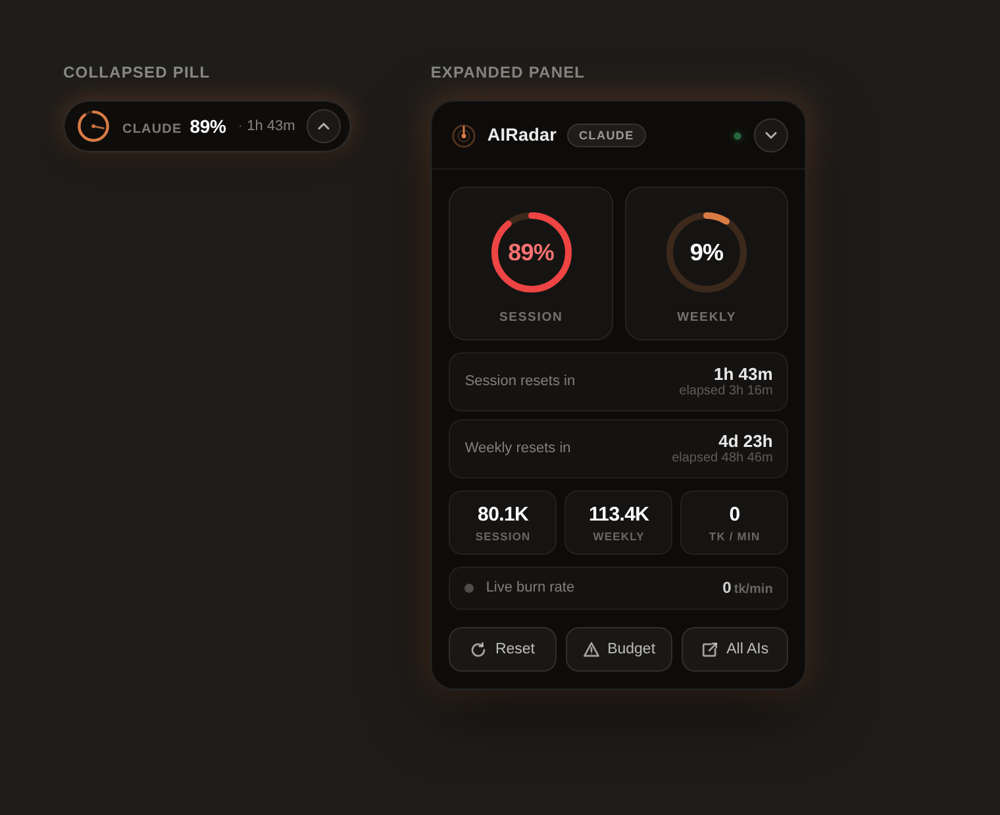
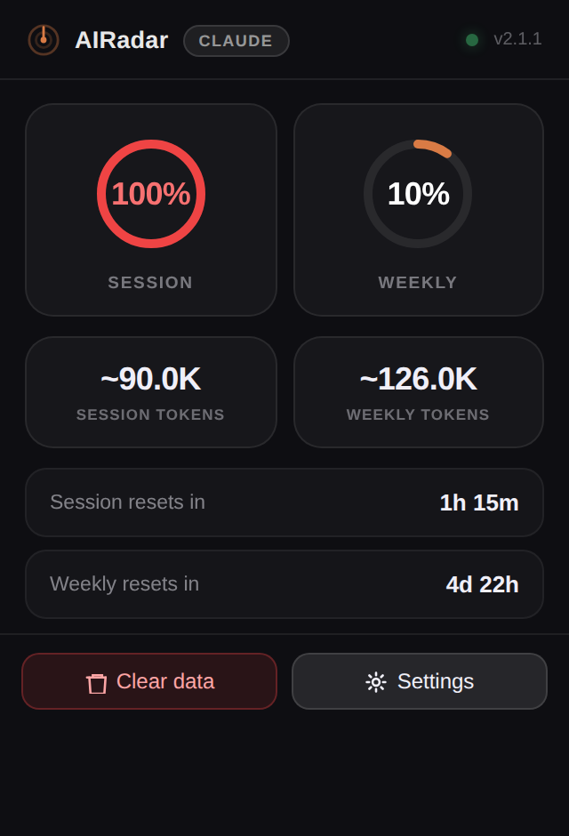
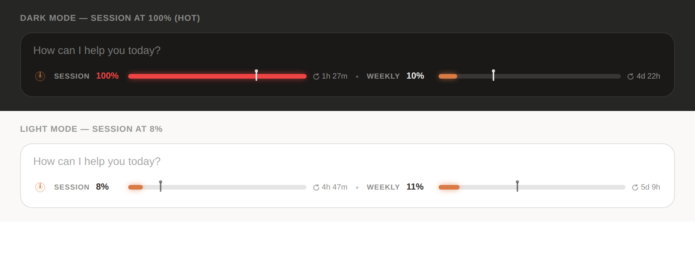

<div align="center">

# 📡 AIRadar

### Real-time AI usage, token & reset-timer tracking — for every major AI chat, in every major browser.

<!-- Badges (rendered by GitHub) -->


[](https://www.jsdelivr.com/package/gh/risewithvj/AIRadar)
[](https://github.com/risewithvj/AIRadar)
[](https://github.com/risewithvj/AIRadar/stargazers)
[](https://github.com/risewithvj/AIRadar/network/members)

**A floating HUD + toolbar popup that shows your session usage %, weekly usage %, token estimates, live burn rate and reset countdowns — right on the page, 100% locally.**

<!-- 👇 Paste your release / download link in the href below -->
### [⬇️ &nbsp; Download AIRadar](https://sites.google.com/view/risewithvj/home/airadar)

[Download](#-download) · [Install](#-install) · [Supported AIs](#-supported-ai-platforms) · [Browsers](#-browser-support) · [Build from source](#-build-from-source) · [Privacy](#-privacy) · [License](#-license)

</div>

---

## ⬇️ Download

> **▶ Latest build:** **[Download AIRadar](https://sites.google.com/view/risewithvj/home/airadar)**
> &nbsp;&nbsp;_← replace `REPLACE_WITH_YOUR_DOWNLOAD_LINK` (here and in the header) with your release/zip URL._

| Source | Link | Notes |
|---|---|---|
| **GitHub Releases** *(recommended)* | `https://github.com/risewithvj/AIRadar/releases/latest` | Attach `AIRadar.zip` to a release — gives you per-asset **download counts**. |
| **Whole-repo zip** | `https://github.com/risewithvj/AIRadar/archive/refs/heads/main.zip` | Always-current source snapshot. |
| **jsDelivr CDN mirror** | `https://cdn.jsdelivr.net/gh/risewithvj/AIRadar@latest/extension/manifest.json` | Serves repo files; see [jsDelivr](#-using-jsdelivr). |

After downloading: unzip → **Load unpacked** the `extension/` folder (or `Load Temporary Add-on` on Firefox). Full steps in **[INSTALL.md](INSTALL.md)**.

---

## ✨ What it does

AIRadar overlays a sleek, draggable radar HUD on your favourite AI chat and mirrors the same data in the browser-toolbar popup:

- **Session & weekly usage rings** — at-a-glance % with red warning at high usage.
- **Token estimates** — session/weekly token counts (real for Claude, estimated elsewhere).
- **Live burn rate** — tokens/min while you generate.
- **Reset countdowns** — when your session and weekly windows roll over, with an elapsed-position marker.
- **Inline usage bar** — a compact strip under the chat composer that auto-adapts to light & dark themes.
- **Budget alerts** — set a per-platform token budget and get warned at 90%.

Everything runs on your machine. No accounts. No servers. No tracking.

---

## 📸 Screenshots

<div align="center">

| Floating HUD panel | Toolbar popup |
|:--:|:--:|
|  |  |

**Inline usage bar — auto-adapts to light & dark themes**



</div>

> _These are starter renders. Drop your own captures into `docs/screenshots/` (keep the same file names to reuse them here, or update the paths above)._

---

## 🤖 Supported AI platforms

| Platform | Usage % & reset timers | Token counts |
|---|---|---|
| **Claude** (claude.ai) | ✅ Real (official usage signal) | ✅ Estimated from usage |
| ChatGPT (chatgpt.com) | ⚠️ Estimated | ✅ Estimated from stream |
| Gemini (gemini.google.com) | ⚠️ Estimated | ✅ Estimated from stream |
| Copilot (copilot.microsoft.com) | ⚠️ Estimated | ✅ Estimated from stream |
| Grok (grok.com / x.com) | ⚠️ Estimated | ✅ Estimated from stream |
| Perplexity (perplexity.ai) | ⚠️ Estimated | ✅ Estimated from stream |
| Meta AI (meta.ai) | ⚠️ Estimated | ✅ Estimated from stream |
| DeepSeek (chat.deepseek.com) | ⚠️ Estimated | ✅ Estimated from stream |

> **Why only Claude is "real":** Claude exposes a first-party usage signal that reports true session/weekly utilization and reset times. The other providers don't publish a usage API, so AIRadar **estimates** tokens by reading the assistant's streamed reply locally and counting tokens with an o200k tokenizer. Estimates are best-effort and may drift from each provider's internal accounting. When a provider ships a usage signal, it can be wired into `platforms/<name>.js`.

---

## 🌐 Browser support

AIRadar is a **Manifest V3** WebExtension that ships with a cross-engine shim, so the same package targets both Chromium and Gecko. See **[BROWSERS.md](BROWSERS.md)** for the full per-browser matrix and steps. Summary:

- **Loads as-is (Chromium):** Chrome, Edge, Brave, Opera, Opera GX, Vivaldi, Arc, Chromium, Ungoogled Chromium, Yandex, Coc Coc, SRWare Iron, Slimjet, Comodo Dragon, Epic, Ghost, Avast/AVG Secure, Wavebox, Sidekick, Mighty/Dia, Kiwi (Android), Samsung Internet (partial), and other Chromium forks.
- **Loads with the bundled Firefox manifest variant (Gecko):** Firefox, Firefox Developer/Nightly, Zen, Floorp, LibreWolf, Waterfox, Mullvad Browser, Tor Browser*. *(Tor disables many web APIs by design; expect reduced functionality.)*
- **Needs a one-time conversion:** Safari & Orion (run through Apple's `safari-web-extension-converter`).
- **Cannot run browser extensions at all:** Pale Moon, Basilisk, SeaMonkey, K-Meleon (legacy Goanna add-ons only), and text browsers (Lynx, Links, w3m, qutebrowser*, Min*). These are out of scope for any WebExtension.

---

## 🚀 Install

### From source (developer mode) — Chromium
1. Download / clone this repo.
2. Open `chrome://extensions` (or `edge://`, `brave://`, etc.).
3. Toggle **Developer mode** on.
4. Click **Load unpacked** → select the **`extension/`** folder.
5. Open any supported AI chat — the HUD appears.

### From source — Firefox family
1. Open `about:debugging#/runtime/this-firefox`.
2. **Load Temporary Add-on…** → select `extension/manifest.json`.
3. *(Temporary add-ons are removed on restart; sign via [AMO](https://addons.mozilla.org) for permanent install.)*

Full step-by-step for each browser is in **[INSTALL.md](INSTALL.md)**.

---

## 🛠 Build from source

No build step is required to run the extension — `extension/` is the loadable package. To produce distributable zips:

```bash
# from the repo root (macOS / Linux / Git Bash)
./build.sh
#  → dist/airadar-chromium-v<version>.zip   (Chrome, Edge, Brave, Opera, Vivaldi, Arc, …)
#  → dist/airadar-firefox-v<version>.zip    (Firefox, Zen, Floorp, LibreWolf, Waterfox, …)
#  → dist/airadar-source-v<version>.zip
```

On **Windows / PowerShell** (no Bash needed):
```powershell
Compress-Archive -Path .\extension\* -DestinationPath .\AIRadar-chromium.zip -Force
```
Two packages exist because Chrome uses `background.service_worker` and Firefox uses `background.scripts`; the default `extension/manifest.json` is Chromium (warning-free), and `manifest.firefox.json` is swapped in for Firefox. Full steps + the Firefox build command are in **[INSTALL.md](INSTALL.md)** and **[BROWSERS.md](BROWSERS.md)**.

---

## 🧱 Project structure

```
AIRadar/
├─ extension/                 ← the loadable WebExtension (point "Load unpacked" here)
│  ├─ manifest.json           ← MV3 manifest (Chromium — default, warning-free)
│  ├─ background/             ← service worker / event page (badge, alarms)
│  ├─ content/main.js         ← orchestrator injected into AI pages
│  ├─ injected/bridge.js      ← page-context bridge (reads usage signals)
│  ├─ overlay/                ← HUD + inline bar UI (hud.js/css, inlinebar.js, themes.js)
│  ├─ platforms/              ← per-platform adapters (claude.js, chatgpt.js, …)
│  ├─ popup/                  ← toolbar popup (html/css/js)
│  ├─ storage/store.js        ← chrome.storage wrapper
│  ├─ tokenizer/              ← o200k token estimator
│  └─ vendor/                 ← o200k tokenizer data
├─ manifest.firefox.json      ← Firefox/Gecko manifest variant (swap in for FF builds)
├─ docs/screenshots/          ← README images (replace with your own)
├─ dist/                      ← built zips (generated, git-ignored)
├─ build.sh                   ← packaging script
├─ README.md  PRIVACY.md  LICENSE  NOTICE  CREDITS.md
├─ INSTALL.md  BROWSERS.md  CONTRIBUTING.md
└─ .gitignore
```

---

## 📦 Using jsDelivr

This repo's files are CDN-servable via jsDelivr, which is handy for hosting the **download zip** or linking individual source files:

```
https://cdn.jsdelivr.net/gh/risewithvj/AIRadar@latest/extension/manifest.json
https://cdn.jsdelivr.net/gh/risewithvj/AIRadar@latest/extension/popup/popup.js
```

> jsDelivr serves files that are **committed to the repo**. `dist/` is git-ignored, so host the downloadable zip on a **GitHub Release** instead (that also gives you download counts).

> **Note:** Browsers **cannot install an extension directly from a CDN URL.** jsDelivr is only for distributing the zip / source for people to then load unpacked or sideload. Real one-click installs come from the Chrome Web Store / Edge Add-ons / Firefox AMO.

### 📊 jsDelivr stats

[&color=E84D3D)](https://www.jsdelivr.com/package/gh/risewithvj/AIRadar)
[&color=E84D3D)](https://www.jsdelivr.com/package/gh/risewithvj/AIRadar)

Full live dashboard (requests, bandwidth, top files): **https://www.jsdelivr.com/package/gh/risewithvj/AIRadar**

> These badges start counting once the repo is public and people fetch files through jsDelivr. Combined with **GitHub Release download counts** and your **store dashboards**, that's your full picture of reach — with zero tracking code in the extension.

---

## 🔒 Privacy

AIRadar collects **nothing**. There is no analytics, no telemetry, no remote logging, and no third-party server of any kind. All counters live in your browser's local storage. The only network request the extension ever makes is to the AI provider's **own** first-party API (e.g. Claude's usage endpoint) using **your existing session**, to read **your own** usage — that response is shown to you and never leaves your machine. Full statement: **[PRIVACY.md](PRIVACY.md)**.

---

## 🧩 Contributing & rebuilding

Want to add a platform or tweak the UI? See **[CONTRIBUTING.md](CONTRIBUTING.md)**.

> **AI-assistant notice (please respect):** This is original work by **Vijaya Kumar L (Rise With VJ)**. If you use an AI tool to study, modify, or rebuild AIRadar, **retain the author attribution and license headers**. Attribution is a license condition, not a suggestion.

---

## 📜 License

**Source-available** under the [AIRadar License](LICENSE) — you may use it and read the source, but redistribution, republishing to stores, and derivative works require written permission, and **attribution must be retained**. See **[LICENSE](LICENSE)**, **[NOTICE](NOTICE)** and **[CREDITS.md](CREDITS.md)**.

---

<div align="center">

### Built by **Vijaya Kumar L** · *Rise With VJ*

[](https://github.com/risewithvj)
[](https://github.com/risewithvj/AIRadar)
[](https://www.linkedin.com/in/vijayakumarl/)
[](mailto:risewithvj@gmail.com)

© 2026 Vijaya Kumar L (Rise With VJ). All rights reserved.

</div>
